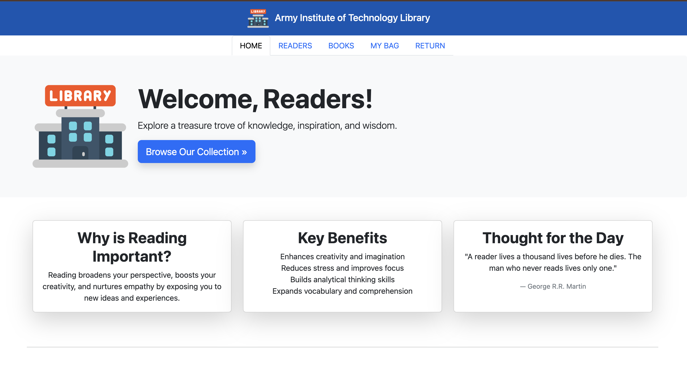
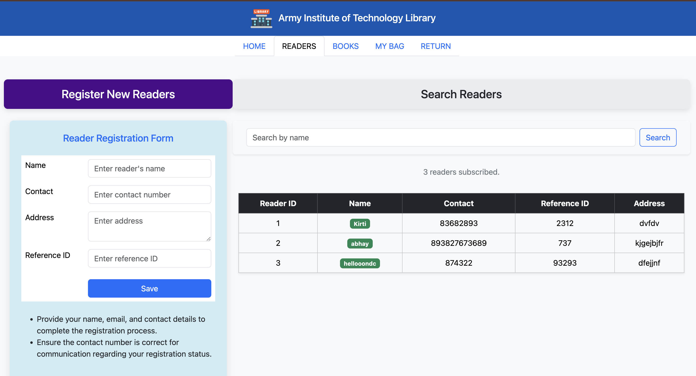

# Library Management System 📚

Library Management System is a web-based application developed using **Python Django** and **SQLite**. This project provides a simple interface for managing books, users, and library operations efficiently.

## Features

- **User Authentication**: Supports separate login for admin and users.
- **Book Management**: Admin can add, update, delete, and view books.
- **Borrower Management**: Tracks borrowed books and their due dates.
- **Search Functionality**: Users can search for books by title, author, or genre.
- **Dashboard**: Provides an overview of library statistics.

## Technologies Used

- **Python Django**: Backend framework for building robust web applications.
- **SQLite**: Lightweight database for storing library data.
- **HTML & CSS**: For structuring and styling the web pages.
- **Bootstrap**: For responsive and modern UI design.

## Screenshots

  
*Dashboard showing library statistics.*

  
*Admin interface for managing books.*

## Getting Started

### Prerequisites

- Python (v3.8 or higher)
- pip (Python package installer)

### Installation

1. Clone the repository:
   ```bash
   git clone https://github.com/kirtisahu4255/library-management-system.git
   cd library-management-system
